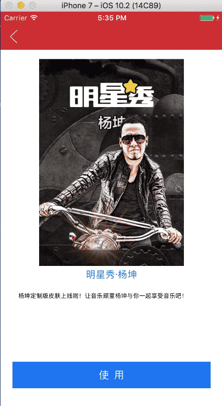

# LNTheme
主题切换OC实现（使用网易云音乐API）

####思路
主要思路把需要更换的控件标记记录，切换主题时重新设置控件的颜色以及属性。

本框架使用`NSHashTable`类来标记，弱引用类无需释放。
使用Block来保存设置选项。
运行时动态给控件添加设置属性`themePickers`。
当需要改变主题时，动态调用方法的`IMP`来改变控件属性。

####类与方法
`LNTheme.h` 主题管理类（提供主题的配置，切换）

```
+ (instancetype)instance;
+ (void)changeTheme:(NSString *)themeName;
+ (UIImage *)imageNamed:(NSString *)name;
+ (UIFont *)fontForType:(LNThemeFontType)type;
+ (UIColor *)colorForType:(LNThemeColorType)type;
+ (NSValue *)imageInsetsForType:(LNThemeImageInsetsType)type;
```
`LNThemePicker.h` 主题选择类 (具体修改什么属性)

```
#pragma mark - ThemePicker
+ (instancetype)initWithColorType:(LNThemeColorType)type;
+ (instancetype)initWithImageName:(NSString *)name;
+ (instancetype)initWithImageName:(NSString *)name renderingMode:(UIImageRenderingMode)mode;
+ (instancetype)initTextAttributesColorType:(LNThemeColorType)color font:(LNThemeFontType)font;

#pragma mark - ThemeStatePicker
+ (instancetype)initWithImageName:(NSString *)name forState:(UIControlState)state;
+ (instancetype)initWithImageName:(NSString *)name forBarMetrics:(UIBarMetrics)state;
+ (instancetype)initWithColorType:(LNThemeColorType)type forState:(UIControlState)state;
+ (instancetype)initTextAttributesColorType:(LNThemeColorType)color font:(LNThemeFontType)font forState:(UIControlState)state;

#pragma mark - ThemeCGColorPicker
+ (instancetype)initWithCGColor:(LNThemeColorType)type;

#pragma mark - ThemeCGFloatPicker
+ (instancetype)initWithCGFloat:(CGFloat)num;

#pragma mark - ThemeEdgeInsetPicker
+ (instancetype)initWithImageInsets:(LNThemeImageInsetsType)type;

#pragma mark - ThemeStatusBarPicker
+ (instancetype)initWithStatusBarAnimated:(BOOL)animated;
@end
```
`NSObject+LNTheme.h` 主题切换核心

```
@interface UIColor (LNTheme)
+ (UIColor *)colorWithHexString:(NSString *)hexString;
@end

@interface UIApplication (LNTheme)
- (void)ln_setStatusBarAnimated:(BOOL)animated;
@end
····
```

`defaultTheme.json` 主题默认配置

####注意事项
需要自定义义颜色主题时，请使用`UIImage+Tint.h`，这个扩展可以生成自定义颜色的图片。

使用方法工程已经给出，请查看Demo。

项目根据网易云音乐API接口而写的一部分设置，可自行根据后台接口返回类型定义相关属性的更改。基本上可以满足大部分需求。

####效果如下图：




